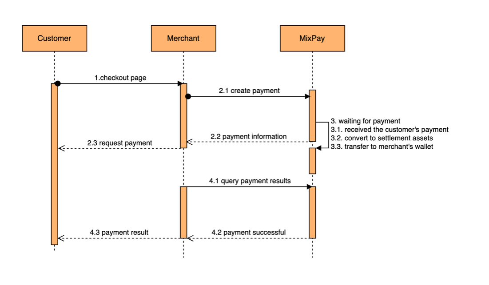

# Getting Started

This document aims to show you how to quickly use MixPay for receiving payments, and outlines some considerations and implementation scenarios.

## Using MixPay

Assuming you are now preparing to sell coffee, with each cup priced at 5 dollars. Clicking the MixPay payment link below will allow you to quickly experience the convenience of MixPay's payment process.

> [`https://mixpay.me/pay?payeeId=8e69e534-d0c4-3e04-8b61-37a73cd9e7d7&quoteAssetId=usd&quoteAmount=5`](https://mixpay.me/pay?payeeId=8e69e534-d0c4-3e04-8b61-37a73cd9e7d7&quoteAssetId=usd&quoteAmount=5)

:::info
In the link above, the `payeeId` represents the payee as MixPay, which you can replace with your own. Additionally, you can change the `quoteAmount` in the link. Please note that this is just an example, and as you can see, you can freely change the `quoteAmount`. Therefore, this is not the best practice for MixPay.
:::

I believe that through the link above, you have experienced how excellent MixPay is. In addition to the most basic on-chain payments, we also support more than ten mainstream wallet apps as convenient payment methods.

## MixPay Payment flow

To get started, let's have a bird's eyes view of the MixPay Payment flow: 

1.  The customer confirms the order details.
2.  The merchant creates orders and asks customers to pay (The checkout page).
3.  MixPay is waiting for payment.
4.  The merchant queries payment results and shows the result to the customer.

## Account

At present, MixPay offers five methods to create an account. You can register an account on [MixPay's Dashboard](https://dashboard.mixpay.me/) at any time.

- Mixin account - Register a Mixin account using your phone number, and then log in by scanning the QR code. Suitable for personal receiving payments.
- MetaMask Acount - Log in using MetaMask wallet authorization. Suitable for personal receiving payments.
- Email Account - Register and log in using email verification code. Suitable for corporate users, with permission functions under development...
- Multi-Signature account -  This is suitable for if multiple people own your store. Please refer to those articles:
  - [How to create a multi-signature account?](https://www.youtube.com/watch?v=TYkM_Uo1Zgs&ab_channel=MixPayProtocol)
  - [How to use multi-signature groups and withdrawals?](https://www.youtube.com/watch?v=tnPKGEglBSE&list=PLPd8WskPRWcx3lRmQfBxpFL021unFo7nN&index=8&ab_channel=MixPayProtocol)
- Mixin Robot account - [Mixin's Messenger Bot](https://developers.mixin.one/docs/dapp/mixin-applications#messenger-bot) it's programmable. More suitable for businesses with higher customization requirements.

If you don't know how to choose, you can go with the "User account", or [contact our customer service](/guides/contact-customer-service).

## Payee ID

`payeeId` is the account's UUID. This UUID is very important and **determines the destination of the money received.** 

There are three ways of getting the payee's UUID: 

* After logging into the [Dashboard]((https://dashboard.mixpay.me/)), you can find the UUID in the [settings](https://dashboard.mixpay.me/settings).

- You can use this bot (7000101422) to get the Mixin User/Robot UUID, send the Mixin ID in the chat window to the bot, and it will reply with the corresponding UUID. It's simple, and no programming is required.

- Also, if the user UUID you want to acquire is a MixPay user, you can quickly get this UUID via [Get Mixin UUID API](/api/users/get-mixin-uuid).

## Where to view all the transactions?

You can check your transaction history in [MixPay's Payment History](https://dashboard.mixpay.me/history) on the Dashboard.

## Where does the money go?

After customers make payments via MixPay, the settlement will go to different destinations based on the account.

- Mixin account - In your Mixin Wallet
- MetaMask Acount - In MetaMask Wallet
- Email Account - In [MixPay Account Wallet](https://dashboard.mixpay.me/wallet)
- Multi-Signature account -  In Multi-Signature Wallet. For more details, please refer to the official [Mixin API documentation](https://developers.mixin.one/docs/mainnet/concepts/multisig).
- Mixin Robot account - In your Mixin Robot Wallet. For more details, please refer to the official [Mixin API documentation](https://developers.mixin.one/docs/api-overview).

## Integrating MixPay

The following are the basic steps for integrating MixPay: 

1. Create a MixPay account for receiving payments.

	* For details on account types and specific instructions, please refer to this link.
2. Use [MixPay's API](/api/overview) to create a payment link for customers to make payments.

	* Determine your quote currency and amount, such as 10 dollars. For more options, see [here](/api/assets/quote-assets).
	* Choose your desired receiving currency; you can choose to receive 10 dollars in USDT or 10 dollars in BTC, whichever you prefer. For more options, see [here](/api/assets/settlement-assets).
	* Enter your callback URL to receive the user's payment results.
3. Checking the payment results is extremely important, and you need to be very cautious.

	* Be sure to follow the steps in [this tutorial](/api/payments/payment-callback).
	* If it is not convenient to use a callback URL during testing, we recommend using [postbin](https://www.toptal.com/developers/postbin).

Furthermore, we offer ready-to-use payment solutions for a variety of use cases:

* [One time payment - Checkout Page](/api/payments/one-time-payment)
* [Using JS SDK](/guides/using-js-sdk)
* [Shopify Plugin](/guides/shopify-plugin)
* [WooCommerce Plugin](/guides/woocommerce-plugin)
* [Using Swap](/api/payments/mixin-memo-payments)
* ......

## Ideal situations for utilizing MixPay

* [Point-of-Sale (PoS)](/guides/solutions/pos)
* [Online Payment](/guides/solutions/online-payment)
* [Instant Exchange](/guides/solutions/instant-exchange)
* ......

## MixPay Protocol

* [Become a broker](/guides/mixpay-protocol/become-a-broker)
* [MixPay+ integration guide](/guides/mixpay-protocol/mixpay-plus)
* [Invoke wallet App](/guides/mixpay-protocol/invoke-wallet-app)