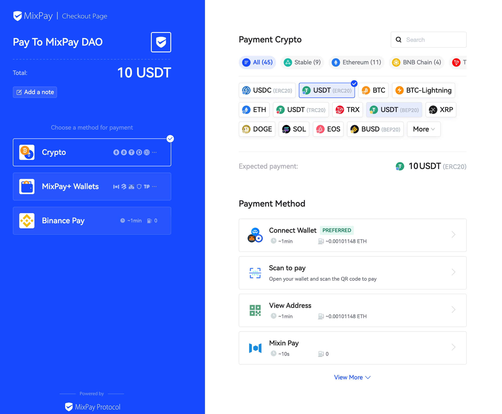
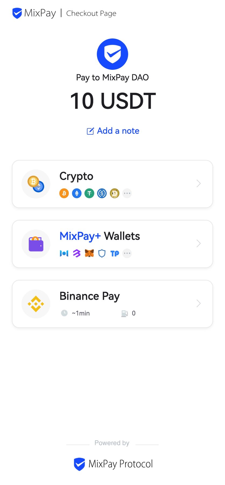
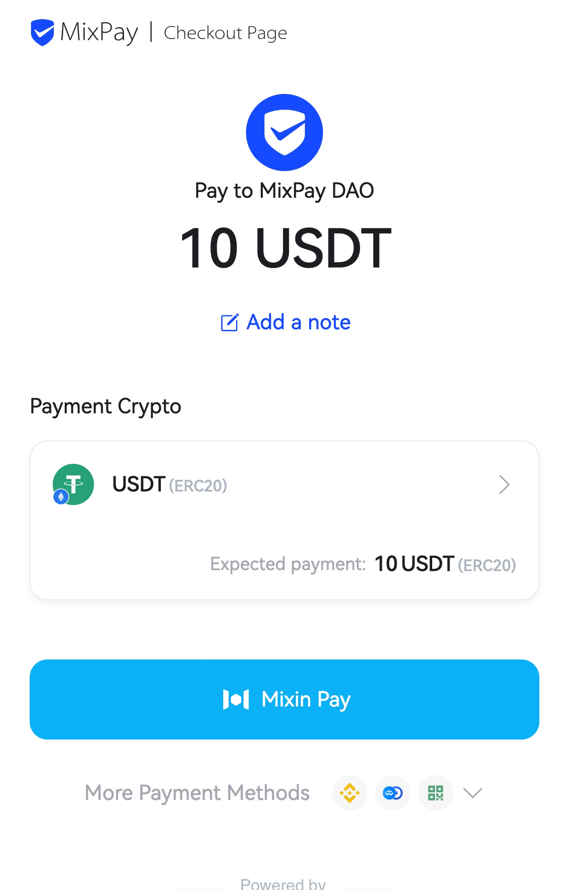

# Using Payment Link

You can use our MixPay payment page to create a MixPay payment. Payment link is the most convenient way of integrating MixPay.

We provide 3 types of payment links:
1. **Permanent Payment Link**: This type of link can be customized and can be used for multiple payments. If you need to implement a long-term payment function, such as a donation, this type of link is a good choice. You can create a permanent payment link quickly in [Dashboard Payment Link](https://dashboard.mixpay.me/payment-link).
2. **One-time Payment Link**: This type of link can only be used for a single payment. If you need to implement a one-time payment function, such as a bill, this type of link is a good choice.You can create a permanent payment link quickly in [Dashboard Billing](https://dashboard.mixpay.me/billing).
3. **Universal Payment Link**: This type of link can achieve the functions of both permanent payment link and One-time payment link by customizing parameters, but the link cannot be personalized. If you need to implement a simple payment function, this type of link is a good choice.


## Start with an example.

Here is an example of universal payment link, click the following button and check it out yourself:

:::warning
IMPORTANT: The example is for new users to understand how the MixPay payment flow. We recommend using [One-time Payment Link](/api/payments/one-time-payment) in the production.

Although this method is more convenient, and you may be more inclined to use this method of splicing parameters, you need to pay attention that when using this method, people can easily in the browser change the parameters you set.

Please checkout the [Security Guidelines](/guides/security-guidelines).
:::


<a href="https://mixpay.me/pay?payeeId=a0d7791408776b47eb1dd3f94ed15d6a&settlementAssetId=c6d0c728-2624-429b-8e0d-d9d19b6592fa&quoteAssetId=4d8c508b-91c5-375b-92b0-ee702ed2dac5&quoteAmount=10&orderId=&returnTo=https%3A%2F%2Fgoogle.com" className="width-300"> 


</a>

For better reference, the "Pay with crypto" button's link is:

```
https://mixpay.me/pay?payeeId=a0d7791408776b47eb1dd3f94ed15d6a
&settlementAssetId=c6d0c728-2624-429b-8e0d-d9d19b6592fa
&quoteAssetId=4d8c508b-91c5-375b-92b0-ee702ed2dac5
&quoteAmount=10
&orderId=your_order_id
&returnTo=https%3A%2F%2Fgoogle.com
```

When customers are on the checkout page, provide a "Pay with Crypto" button (with the above URL): 


1. When customers click the button, jump to our MixPay payment page;
2. On our MixPay payment page, customers pay the crypto coin;
3. We will redirect you to your site after the customer finishes the payment.

## Parameters explain

Below is how to construct the URL parameters, according to the example URL above: 

```bash
payeeId=a0d7791408776b47eb1dd3f94ed15d6a
settlementAssetId=c6d0c728-2624-429b-8e0d-d9d19b6592fa
quoteAssetId=4d8c508b-91c5-375b-92b0-ee702ed2dac5
quoteAmount=10
orderId=your_order_id
returnTo=https%3A%2F%2Fgoogle.com
```


1. `payeeId` is the receiver ID in UUID format. Here is how you can see the UUID  [get-mixin-uuid API](/api/users/get-mixin-uuid);
2. `settlementAssetId` is the specific coin will the payee wan to accept. You can see the supported asset id in [Settlement Assets](/api/assets/settlement-assets) in UUID format.
3. `quoteAssetId` is the cryptocurrency in UUID format, and you can see the supported asset id in [Quote Assets](/api/assets/quote-assets).
4. `quoteAmount` is the total payment amount according to the `quoteAssetId`.
5. `orderId`   -   Unique in your system. String lengths **between 6 and 36 must be letters, numbers, dashes, underscores, and NO space. `orderId` and `payeeId` make a payment unique. 
6. `returnTo` when the payment is finished, the customer will be redirected to this URL. Generally will be the order detail page.


## Special Parameters For Payment Link
There are several parameters here, used to specify the default behavior of the Checkout Page(both of permanent payment link, One-time payment link, and universal payment link).

1. `amount` is the total payment amount according to the `quoteAssetId`, and takes priority over `quoteAmount`.
2. `paymentAssetId` is used to specify the coin that the user wants to pay with, and you can see the supported asset id in [Payment Assets](/api/assets/payment-assets) in UUID format.
3. `paymentMethod` is used to specify the payment type, which can be `crypto`, `mixpayplus`, or `binance`.
4. `payerEmail` is used to specify the email address of the payer to receive the payment results. `payerEmail` must be valid, or you can not create a payment. 
5. `style` The page is divided into **Desktop template**, **Mobile Universal template**, and **Mobile Wallet template**. Setting `style=mobile` can force the mobile side to use the **Mobile Universal template**.

| template name | example |
|----|----|
| Desktop Template |  |
| Mobile Universal Template |  |
| Mobile Wallet Template |  |

## Special Events For Payment Link

1. if you want to embed the checkout page into your website by using an iframe. there is an example for you.

```html
<iframe src="https://mixpay.me/pay?payeeId=a0d7791408776b47eb1dd3f94ed15d6a
&settlementAssetId=c6d0c728-2624-429b-8e0d-d9d19b6592fa
&quoteAssetId=4d8c508b-91c5-375b-92b0-ee702ed2dac5
&quoteAmount=10
&orderId=your_order_id" style="width:100%;height:100%;border:none"></iframe>
<script>
  window.addEventListener('message', function(event) {
    if(event.data.type === 'MIXPAY_PAYMENT') {
      if (event.data.data.status === 'pending') {
        // To do something when the payment is confirmed.
      }

      if (event.data.data.status === 'success') {
        // To do something when the payment is success.
      }

      if (event.data.data.status === 'failed') {
        // To do something when the payment is failed.
      }
    }
  });
</script>
```


## Getting the result

At this point, customers are paying crypto using our Payment Link; how can you get the paying results?

You can use the [Payment Callback](/api/payments/payment-callback) to get the feedback.
