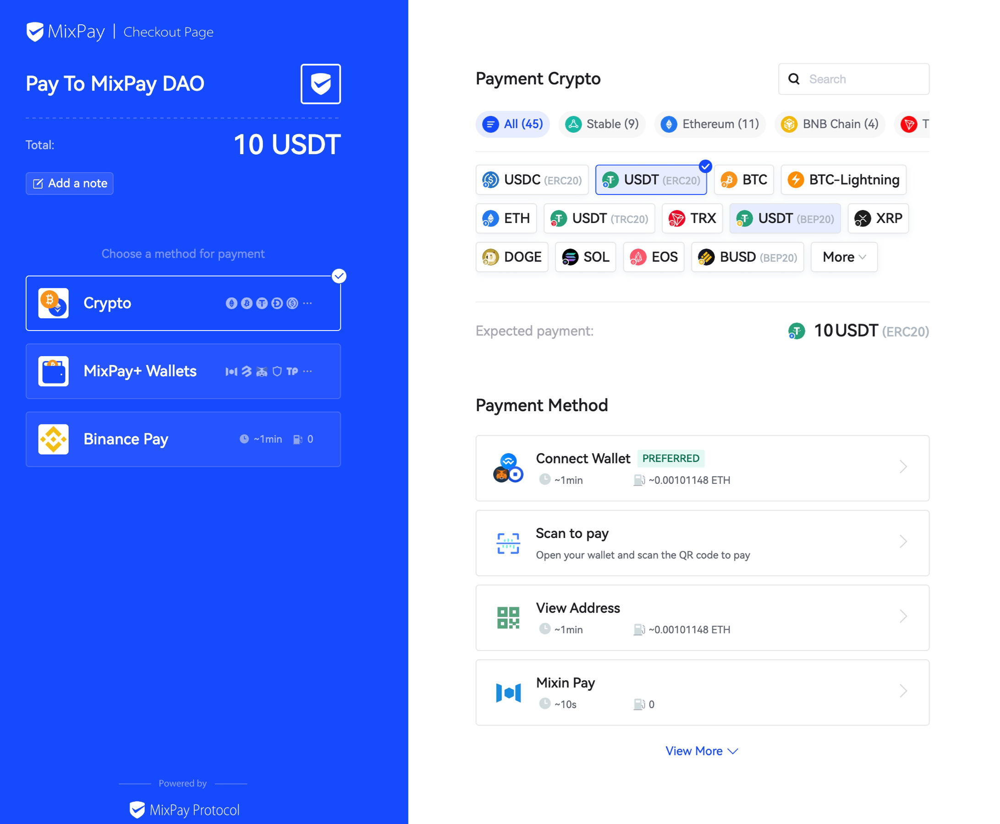
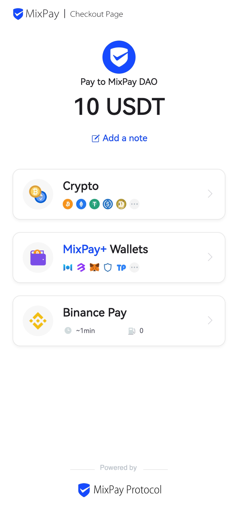
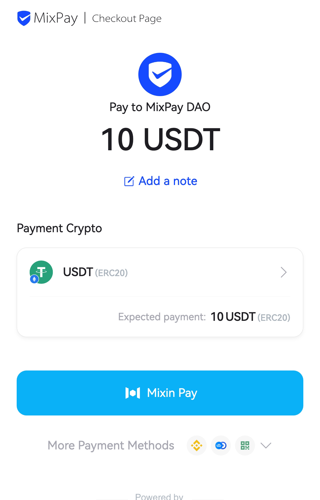

# Payment Link (Checkout Page)

You can use our MixPay payment page to create a MixPay payment. Payment link is the most convenient way of integrating MixPay.

We provide 3 types of payment links:
1. **Permanent Payment Link**: This type of link can be customized and can be used for multiple payments. If you need to implement a long-term payment function, such as a donation, this type of link is a good choice. You can create a permanent payment link quickly in [Dashboard Payment Link](https://dashboard.mixpay.me/payment-link).
2. **One-time Payment Link**: This type of link can only be used for a single payment. If you need to implement a one-time payment function, such as a bill, this type of link is a good choice.You can create a permanent payment link quickly in [Dashboard Billing](https://dashboard.mixpay.me/billing).
3. **Universal Payment Link**: This type of link can achieve the functions of both permanent payment link and One-time payment link by customizing parameters, but the link cannot be personalized. If you need to implement a simple payment function, this type of link is a good choice.


## Start with an example.

Here is an example of universal payment link, click the following button and check it out yourself:

:::warning
IMPORTANT: The example is for new users to understand how the MixPay payment flow. We recommend using [One-time Payment Link](/api/payments/one-time-payment) in the production.

Although this method is more convenient, and you may be more inclined to use this method of splicing parameters, you need to pay attention that when using this method, people can easily in the browser change the parameters you set.

Please checkout the [Security Guidelines](/guides/security-guidelines).
:::


<a href="https://mixpay.me/pay?payeeId=8e69e534-d0c4-3e04-8b61-37a73cd9e7d7&settlementAssetId=c6d0c728-2624-429b-8e0d-d9d19b6592fa&quoteAssetId=4d8c508b-91c5-375b-92b0-ee702ed2dac5&quoteAmount=10&orderId=&returnTo=https%3A%2F%2Fgoogle.com" className="width-300"> 


</a>

For better reference, the "Pay with crypto" button's link is:

```
https://mixpay.me/pay?payeeId=8e69e534-d0c4-3e04-8b61-37a73cd9e7d7
&settlementAssetId=c6d0c728-2624-429b-8e0d-d9d19b6592fa
&quoteAssetId=4d8c508b-91c5-375b-92b0-ee702ed2dac5
&quoteAmount=10
&orderId=your_order_id
&returnTo=https%3A%2F%2Fgoogle.com
```

When customers are on the checkout page, provide a "Pay with Crypto" button (with the above URL): 


1. When customers click the button, jump to our MixPay payment page;
2. On our MixPay payment page, customers pay the crypto coin;
3. After success, a non-iframe result page may navigate to `returnTo`. Automatic navigation is conditional and is not proof of payment.

## Parameters explain

Below is how to construct the URL parameters, according to the example URL above: 

```bash
payeeId=8e69e534-d0c4-3e04-8b61-37a73cd9e7d7
settlementAssetId=c6d0c728-2624-429b-8e0d-d9d19b6592fa
quoteAssetId=4d8c508b-91c5-375b-92b0-ee702ed2dac5
quoteAmount=10
orderId=your_order_id
returnTo=https%3A%2F%2Fgoogle.com
```


1. `payeeId` is the receiver ID in UUID format. Here is how you can see the UUID  [get-mixin-uuid API](/api/users/get-mixin-uuid);
2. `settlementAssetId` is the specific coin will the payee wan to accept. You can see the supported asset id in [Settlement Assets](/api/assets/settlement-assets) in UUID format.
3. `quoteAssetId` is the cryptocurrency in UUID format, and you can see the supported asset id in [Quote Assets](/api/assets/quote-assets).
4. `quoteAmount` is the total payment amount according to the `quoteAssetId`.
5. `orderId`   -   Unique in your system. String lengths **between 6 and 36 must be letters, numbers, dashes, underscores, and NO space. `orderId` and `payeeId` make a payment unique. 
6. `returnTo` is the preferred destination after a successful payment. Automatic navigation can be suppressed for iframe, surplus/refund, or merchant-controlled return flows and must not be used as a payment notification.


## Special Parameters For Payment Link

There are several parameters here, used to specify the default behavior of the Checkout Page(both of permanent payment link, One-time payment link, and universal payment link).

1. `amount` is the total payment amount according to the `quoteAssetId`, and takes priority over `quoteAmount`.
2. `paymentAssetId` is used to specify the coin that the user wants to pay with, and you can see the supported asset id in [Payment Assets](/api/assets/payment-assets) in UUID format.
3. `paymentMethod` is used to specify the payment type, which can be `crypto`, `mixpayplus`.
4. `paymentWallet` is used to specify the payment wallet, which can be `gateio`, `binance`.
5. `onlyShowWallet` is used to only show a specific wallet channel. Setting `onlyShowWallet=balance` will only show Binance Pay.
6. `payerEmail` is used to specify the email address of the payer to receive the payment results. `payerEmail` must be valid, or you can not create a payment. 
7. `style` The page is divided into **Desktop template**, **Mobile Universal template**, and **Mobile Wallet template**. Setting `style=iframe` can force to use the **Mobile Universal template**.

| template name | example |
|----|----|
| Desktop Template |  |
| Mobile Universal Template(`iframe`) |  |
| Mobile Wallet Template |  |

## Embedding the Payment Link

Set `style=iframe` to embed the hosted checkout. The result page sends UI notifications to its top-level parent with this shape:

```json
{
  "type": "MIXPAY_PAYMENT",
  "data": {
    "traceId": "39878c67-a749-4e2f-a495-743d139db9f2",
    "clientId": "bb5bdb53-075e-4b40-a6cc-1d81b8c2f78d",
    "status": "confirming"
  }
}
```

Treat the message as a checkout UI notification, not as an authoritative or guaranteed delivery channel. Validate both `event.origin` and `event.source`, then query `payments_result` from your server before fulfillment.

```html
<iframe
  id="mixpay-checkout"
  src="https://mixpay.me/pay?payeeId=8e69e534-d0c4-3e04-8b61-37a73cd9e7d7&style=iframe&settlementAssetId=c6d0c728-2624-429b-8e0d-d9d19b6592fa&quoteAssetId=4d8c508b-91c5-375b-92b0-ee702ed2dac5&quoteAmount=10&orderId=your_order_id"
  style="width:100%;height:100%;border:none"
></iframe>

<script>
  const checkoutFrame = document.querySelector('#mixpay-checkout');
  const expectedOrigin = new URL(checkoutFrame.src).origin;

  window.addEventListener('message', async function (event) {
    if (event.source !== checkoutFrame.contentWindow) return;
    if (event.origin !== expectedOrigin) return;
    if (!event.data || event.data.type !== 'MIXPAY_PAYMENT') return;

    const snapshot = event.data.data;

    // Send snapshot.traceId to your server. Your server must query
    // GET /v1/payments_result and verify the stored order fields.
    const result = await getVerifiedResultFromYourServer(snapshot.traceId);

    if (result.status === 'success') {
      completeCheckoutOnce(result);
    } else if (result.status === 'failed') {
      showPaymentFailure(result.failureCode, result.failureReason);
    } else if (result.status === 'paid_less') {
      showTopUpProgress(result);
    } else {
      showPaymentInProgress(result.status);
    }
  });
</script>
```

`unpaid`, `confirming`, `paid_less`, `pending`, and `auditing` are non-terminal. When an iframe order is underpaid, the hosted flow may navigate the iframe back to the payment page so the payer can send the remaining amount. Keep the original merchant order, `traceId`, and existing `clientId` channel, but use only the latest payment asset, amount, destination, and Tag/Memo returned by the refreshed payment information.

When `style=iframe` is used, the hosted page does not automatically redirect the top-level merchant page after success. The parent page is responsible for its own navigation. Do not rely on iframe message frequency, ordering, or continued delivery.

## Getting the result

Configure a [Payment Callback](/api/payments/payment-callback) for prompt server notification, and keep server-side polling as a fallback. In both cases, query [`GET /payments_result`](/api/payments/payments-results) and fulfill only after verifying an authoritative `success` result. See [Payment Lifecycle](/api/payments/payment-lifecycle).
