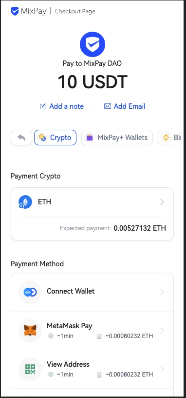
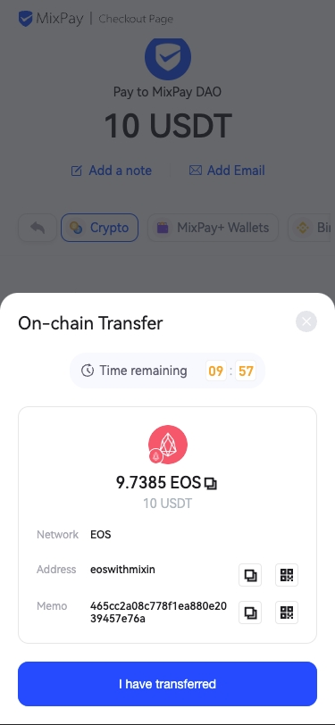

# Using Raw API

This method is the most flexible way to make a MixPay payment.

It's suitable for scenarios that can not use a browser, such as the Mobile Native App.


## Constructing the accept payment view

When a customer makes a purchase, on your App check-out page, show a "Pay with Crypto" button. When the customer clicks the button, you should construct an App view like our [MixPay payment page.](https://mixpay.me/pay?payeeId=a0d7791408776b47eb1dd3f94ed15d6a&settlementAssetId=c6d0c728-2624-429b-8e0d-d9d19b6592fa&quoteAssetId=4d8c508b-91c5-375b-92b0-ee702ed2dac5&quoteAmount=10&orderId=product1000432&returnTo=https%3A%2F%2Fgoogle.com)



1. In this view:
    1. Using [Quote Assets ](/api/assets/quote-assets)API to fetch the price in any supported cryptocurrency;
    2. Using [Payment Assets ](/api/assets/payment-assets)API to let customers select which cryptocurrency they want to pay;
    3. Tip: Above API calls can all happen on your App Side.

2. When the customer **clicks to choose a payment method**, based on which wallet has been chosen: 
    1. If the customer chooses "Mixin Wallet", you can call our [accepting-payments API](/api/payments/accepting-payments) to create a payment;
    
    2. If the customer chooses other payment methods, you should call our [on-chain-payments API](/api/payments/onchain-payments) to create a payment;
    
3. When payment is created successfully, your App base the response and performs corresponding actions to collect user payments (This step will explain later).

4. When the customer finishes paying crypto ( depending on what cryptocurrency the customer chooses to pay, the delay varies from 5 seconds to 30mins or more), showing a "Waiting Payment Processing" hint to the customer;

5. In the meantime, the App client uses the `orderId` to call [payments-results API](/api/payments/payments-results) for checking payment results. Or using the [Payment Callback](/api/payments/payment-callback) on your server side.

6. It's recommended to make the Payments Results API call every two seconds.


### Pay with Mixin wallet 

In step 3, if the customer is selecting Pay using Mixin Wallet, your App should call [accepting-payments API](/api/payments/accepting-payments).

When getting the MixPay API result, your App client has to call Mixin App using URL Schema([What is URL Schema? ](https://helpcenter.trendmicro.com/en-us/article/tmka-18277)) to finish the payment:  

```bash
mixin://pay?recipient=&asset=&amount=&memo=&trace=
```

As you can see, there are parameters in the Mixin URL Schema, those parameter value are matching  [Accepting Payments ](/api/payments/accepting-payments)response as following: 

```bash
// Mixin Param = MixPay Accepting Payments API result
recipient=recipient
asset=paymentAssetId
amount=paymentAmount
memo=memo
trace=traceId
```

Just passing the key value correspondingly, and the URL Schema will do the rest.

> For more info for Mixin URL Schema, please read [this article](https://developers.mixin.one/docs/schema).

### Pay with other payment methods

In step 3, if the customer chooses other payment methods, your App should call [on-chain payment API](/api/payments/onchain-payments).

> Note: [on-chain-payments API](/api/payments/onchain-payments) and [accepting-payments API](/api/payments/accepting-payments) use the same endpoint; the only difference is the on-chain payment API payload with an `isChain` key set to `true`.

At the [on-chain-payments API](/api/payments/onchain-payments) JSON Response, there is a key call `destination`; this is the Address customer has to transfer the cryptocurrency.

You can reference the following UI to construct your App View:



> **Note: If the payment assets are EOS, you can use the** **`tag`** **and** **`destination`** **from the API result.**


## Expiration


There are two kinds of expiration on creating a MixPay payment.


### 1. Payment expired (closed)


In online shopping flow, sometimes you have this business logic - when your order expired, you need to release the inventory.


You can provide the `expiredTimestamp` parameter, to keep the MixPay payment in sync with your order expiration time.


When MixPay payment expired, the user will not be able to able to pay. (You need to construct the UI on your side.)


If you leave `expiredTimestamp` parameter empty, this payment will be valid.


### 2. Tolerate period expired (refresh needed)


If the customer's payment asset is different than the settlement assets, let's say the payment asset is BTC and the settlement asset is ETH. MixPay will convert BTC to ETH internally for the merchants. 


But due to the risk of crypto price fluctuations,  for example, if the customer is finishing the payment after 24 hours, and the BTC price drops from $25000 to $22000.


So we need to set a reasonable expiration time, otherwise, we may suffer tremendous loss. This expiration time we call it "tolerate period". 


"tolerate period" is defined internally. When creating a payment, will have there two fields in the response: 


```bash
// Unit Timestamp for accuracy
"expire":1659340995,

// A little helper for setting up the countdown
"seconds":60,
```


When the "tolerate period" is expired, you **must** request the create payment API with the same parameters. MixPay will recalculate the `paymentAmount` .  


:::warning

If a customer pays with a "tolerate period" expired payment, if is "Pay with Mixin wallet", the crypto assets will refund, and the payment result will be `payment overtime`. If is "Pay using an on-chain Wallet", due to the crypto transfer's nature, we can not refund the money directly, we must get the customer's wallet address first, in this scenario, you can instruct the customer to [contact our customer service](https://help.mixpay.me/en/articles/6836092-how-to-contact-customer-service). 

:::


## Getting the result

At this point, customers are paying crypto using our Paylink; how can you get the paying results?

On your server side, you can loop through the [payments-results API](/api/payments/payments-results) using `orderId` + `payeeId`.

It's recommended to implement the [Payment Callback](/api/payments/payment-callback) flow, for better performance.


## Multi-payment

If the user has underpaid, we can ask them to make an additional payment to complete the order.If you are using MixPay's Checkout Page,  multiple payments are already integrated, and you don't need to perform any additional actions. Simply check the `data.status` in the response to determine if it is equal to `success`.

However, if you are using the [Raw API](/guides/using-raw-api) to build your own checkout page, and you want to support multiple payments, you need to perform the following steps.

When calling the [payments-results API](/api/payments/payments-results):

1. Use the `with` parameter with the value `payment,transactions` in the URI to retrieve the `payment` and `transactions` objects.
2. Check the value of `data.payment.isFullyPaid`. If it is true, the payment has been fully paid; otherwise, it is false.
   - If it is true, check if `data.status` is `success` to determine if the order is successful. If it is `pending`, it means the transactions are waiting for block confirmation.
3. If the value of `data.payment.isFullyPaid` is false, subtract `data.payment.totalTransactionsAmount` from `data.payableAmount` to determine the remaining amount the user needs to pay.

:::info
Users have only 10 minutes to complete the payment (from the time MixPay receives the broadcast transaction).
For multiple payments, the subsequent payment time may be reduced. You can call the [Onchain Payments](/api/payments/onchain-payments) endpoint once again with the same parameters as the initial call to refresh the payment time.
Please note that each time you call the [Onchain Payments](https://chat.openai.com/api/payments/onchain-payments) endpoint, the payment time will be updated, and the `data.payableAmount` will be updated accordingly.
:::

Q: If a user makes multiple payments exceeding the order amount, will the payment be successful?
A: Yes, it will be successful. In this case, check if `data.surplusStatus` is `yes`. The amount to be refunded is `data.surplusAmount`. Please refer to the MixPay Checkout Page for the specific refund process.

Q: Can other payment methods (Mixin, Binance) support multiple payments?
A: No. Only on-chain transfers support multiple payments.
