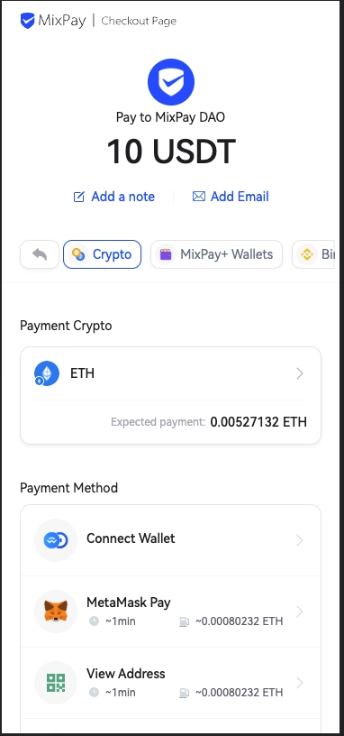
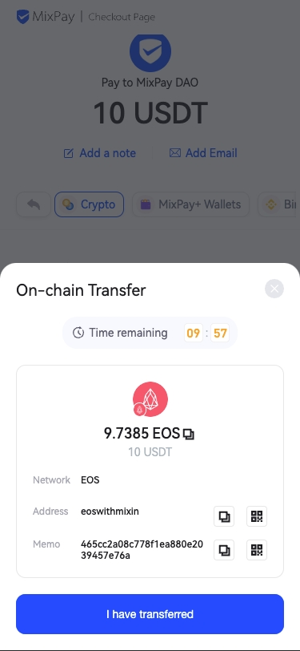

# Using Raw API

This method is the most flexible way to make a MixPay payment.

It's suitable for scenarios that can not use a browser, such as the Mobile Native App.

:::warning
Please note using raw API is deprecated. Please using [one time payment](/api/payments/one-time-payment) and our checkout page in the production.
:::

## Constructing the accept payment view

When a customer makes a purchase, on your App check-out page, show a "Pay with Crypto" button. When the customer clicks the button, you should construct an App view like our [MixPay payment page.](https://mixpay.me/pay?payeeId=8e69e534-d0c4-3e04-8b61-37a73cd9e7d7&settlementAssetId=c6d0c728-2624-429b-8e0d-d9d19b6592fa&quoteAssetId=4d8c508b-91c5-375b-92b0-ee702ed2dac5&quoteAmount=10&orderId=product1000432&returnTo=https%3A%2F%2Fgoogle.com)



1. In this view:
    1. Using [Quote Assets ](/api/assets/quote-assets)API to fetch the price in any supported cryptocurrency;
    2. Using [Payment Assets ](/api/assets/payment-assets)API to let customers select which cryptocurrency they want to pay;
    3. Tip: Above API calls can all happen on your App Side.

2. When the customer **clicks to choose a payment method**, based on which wallet has been chosen: 
    1. If the customer chooses "Mixin Wallet", you can call our [accepting-payments API](/api/payments/accepting-payments) to create a payment;
    
    2. If the customer chooses other payment methods, you should call our [on-chain-payments API](/api/payments/onchain-payments) to create a payment;
    
3. When payment is created successfully, your App base the response and performs corresponding actions to collect user payments (This step will explain later).

4. When the customer finishes paying crypto ( depending on what cryptocurrency the customer chooses to pay, the delay varies from 5 seconds to 30mins or more), showing a "Waiting Payment Processing" hint to the customer;

5. In the meantime, your merchant server polls the [Payment Result API](/api/payments/payments-results) or receives a [Payment Callback](/api/payments/payment-callback). The App should query your backend, not call MixPay directly to decide fulfillment.

6. Choose a polling interval appropriate for your application and rate limits, and stop only when the server observes `success` or `failed`.


### Pay with Mixin wallet 

In step 3, if the customer is selecting Pay using Mixin Wallet, your App should call [accepting-payments API](/api/payments/accepting-payments).

When getting the MixPay API result, your App client has to call Mixin App using URL Schema([What is URL Schema? ](https://helpcenter.trendmicro.com/en-us/article/tmka-18277)) to finish the payment:  

```bash
mixin://pay?recipient=&asset=&amount=&memo=&trace=
```

As you can see, there are parameters in the Mixin URL Schema, those parameter value are matching  [Accepting Payments ](/api/payments/accepting-payments)response as following: 

```bash
// Mixin Param = MixPay Accepting Payments API result
recipient=recipient
asset=paymentAssetId
amount=paymentAmount
memo=memo
trace=traceId
```

Just passing the key value correspondingly, and the URL Schema will do the rest.

> For more info for Mixin URL Schema, please read [this article](https://developers.mixin.one/docs/schema).

### Pay with other payment methods

In step 3, if the customer chooses other payment methods, your App should call [on-chain payment API](/api/payments/onchain-payments).

> Note: [on-chain-payments API](/api/payments/onchain-payments) and [accepting-payments API](/api/payments/accepting-payments) use the same endpoint; the only difference is the on-chain payment API payload with an `isChain` key set to `true`.

At the [on-chain-payments API](/api/payments/onchain-payments) JSON Response, there is a key call `destination`; this is the Address customer has to transfer the cryptocurrency.

You can reference the following UI to construct your App View:



> **Note: If the payment assets are EOS, you can use the** **`tag`** **and** **`destination`** **from the API result.**


## Expiration

Raw API responses expose two different time concepts:

| Field | Meaning |
| --- | --- |
| `expire` / `seconds` | Current quote or payment-address refresh window. A refreshed instruction can change `paymentAmount` or payment details. |
| `payments_result.expiredAt` | Fixed payment deadline of the overall order. A refresh does not extend it. |

`expiredTimestamp` sets an absolute upper bound for the payment deadline. Omitting it does not make the payment valid indefinitely because MixPay and the selected payment method can impose earlier limits. Proxy-payment methods, including BTC Lightning, have a maximum effective payment window of 60 minutes.

Transactions first recognized after the payment deadline cannot complete the original order. If the full amount is recognized before that deadline, blockchain confirmation may continue after `expiredAt` until MixPay's separate confirmation deadline.

When the quote or address refresh window ends, request the latest payment information only while the order remains non-terminal. Do not reuse a `traceId` after `success` or `failed`, and never assume that a refreshed quote extends the overall order deadline.

Late or invalid payments can require an automatic refund or manual review depending on the payment method and failure reason. A `failed` payment result is not proof that a refund has completed.


## Getting the result


It's recommended to implement the [Payment Callback](/api/payments/payment-callback) flow, for better performance.

Poll the [Payment Result API](/api/payments/payments-results) from your server using `traceId`, or use `orderId` together with `payeeId`. 

> Tip: Poll the Payment Result API can easily hit our API rate limit. For better performance and stable use, always using the [Payment Callback](/api/payments/payment-callback) flow.

Only `success` and `failed` are terminal. Keep `unpaid`, `confirming`, `paid_less`, `pending`, and `auditing` open. Fulfill only after your server verifies a `success` result and the expected payee, quote asset, and amount.


## Multi-payment (pay less)

If the user has underpaid, we can ask them to make an additional payment to complete the order. If you are using MixPay's Checkout Page,  multiple payments are already handled, and you don't need to perform any additional actions. Simply check the `data.status` in the response to determine if it is equal to `success`.

However, if you are using the [Raw API](/guides/using-raw-api) to build your own checkout page, you need to support multiple payments in order to improve the payments success rate. 

To support multiple payments, you need to perform the following steps.

When calling the [Payment Result API](/api/payments/payments-results):

1. Request `with=payment,transactions`.
2. Use `data.status === "paid_less"` as the primary underpayment signal. Integrations created before `paid_less` was introduced may retain `data.status === "pending" && data.payment.isFullyPaid === false` as a compatibility fallback.
3. Calculate `remainingAmount = max(data.payableAmount - data.paymentAmount, 0)` using decimal-safe arithmetic. The top-level `paymentAmount` is the authoritative amount recognized for the order; do not derive it by summing unfiltered transaction rows.
4. Retrieve the latest payment instructions and ask the payer to send the remaining amount using the same payment asset, destination, merchant order, and `traceId`.
5. Continue polling. `confirming` means recognized transactions still need confirmations; `pending` means MixPay has accepted the payment as fully paid and the confirmation requirements are satisfied while order processing continues.

Do not create a new merchant order for the remaining amount. A refreshed instruction cannot extend `payments_result.expiredAt`, and a terminal trace cannot be refreshed into a new payment.

Q: If a user makes multiple payments exceeding the order amount, will the payment be successful?
A: An overpayment can still complete successfully. Check whether `data.surplusAmount` is greater than zero, then track `data.surplusStatus` (`no`, `pending`, `sending`, `success`, or `expired`) separately. Payment success does not mean that a surplus refund is complete.

Q: Can other payment methods (Mixin, Binance) support multiple payments?
A: No. Only on-chain transfers support multiple payments.
