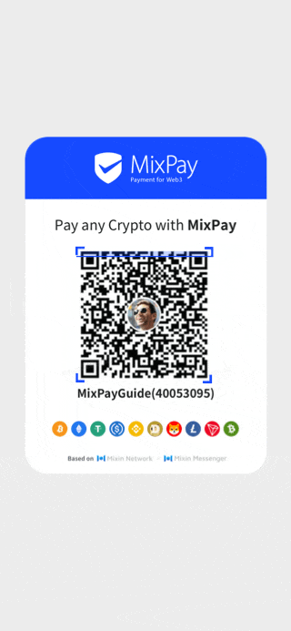

# Guaranteed Trades

Integrating MixPay into your Guaranteed Trades system takes only four steps.

## Introduction

Before you get started, all you need to know is that it takes only four steps to integrate MixPay into your Guaranteed Trades system. They are as follows.

1.  Create the multi-signature group.
2.  Create the payment link.
3.  Look query the payment results
4.  Guaranteed trades based on Mixin's multi-signature API.

More about MixPay, you can check [this](/guides/introduction) for reference.

## Demo

This is the demo of MixPay.



## For developers

There is no need to register MixPay to use MixPay API. You can use MixPay API with your preferred languages. MixPay API click [here](/api/overview).

Before you start, you need to know that through the API of MixPay, the crypto paid by the user is settled directly to your Mixin bot, MixPay user, or Mixin Wallet.

Mixin bot and MixPay user (ID of MixPay user is equal to Mixin ID) both have the same parameter, called **UUID**. This UUID is very important and determines the destination of the money received. The UUID is used to describe the Mixin bot and Mixin user in the multi-signature group, and it's called the hash id of the multi-signature group. The assets in your Mixin bot are programmable, and the assets in MixPay you can withdraw and manage easily.

Next, we start with a detailed guide.

### Step 1 - Create the multi-signature group

We should know that the members of a multi-signature group can be either common users or robots. Just like a multi-signature group have three members named A, B, and C, and the threshold of a multi-signature group is 2, the transaction will only be sent if 2 of the 3 members are signed.

More about the multi-signature concept, you can click [here](https://developers.mixin.one/docs/mainnet/concepts/multisig) for reference.

Then you need to use this [API](/api/multisig/get-multisig-id) to generate the `multisigId`. The parameter is an array, which includes the UUID of the multi-signature group members. And the response of this API is the `multisigId`. It's an essential parameter for receiving funds for multi-signature groups.

### Step 2 - Create the payment link

In the first step, you generate `multisigId`, and then you need to use this parameter to create the payment link. You can use this [API](/api/payments/pay) to integrate with MixPay.

The specific parameters are below, and the `payeeId` must be `multisigId` generated in the first step. Then you can convert this URL to a QR code, and the users scan the QR code to pay, or it could say that the funds are deposited into a multi-signature group.

### Parameters

|  Param | Optional | Type | Description |
| --- | --- | --- | --- |
| `payeeId` | <span class="required">*required</span> | String | three settlement modes are supported, normal user, robot, and multisig group, so it is usually the Mixin UUID of a normal user or robot. You can also specify the multisigId of a sub-account. |
| `settlementAssetId` | optional | String | assetId of settlement cryptocurrency. Settlement assets you prefer. If left blank, the payee will receive the cryptocurrency the user pays for. |
| `quoteAssetId` | optional | String | assetId of quote cryptocurrency.|
| `quoteAmount` | optional | Numeric | Amount of cryptocurrency received, if left blank, the user can enter manually. |
| `remark` | optional | String | Payment remark viewable by the payee. |
| `traceId` | optional | String | UUID, used to prevent double payment. |

The following section will explain the meaning of the parameters of this API and how they are used.

The ID of cryptocurrency you need to acquire. The type of assets is used for settlement and quote. Also, you can click [here](/guides/assets) for the detail about supported assets.

And the `traceId` you can generate randomly. If you use Golang, the sample code is like below.

```go
package main

import (
    "fmt"
    "github.com/google/uuid"
)

func main() {
    id := uuid.New()
    fmt.Println(id.String())
}
```

Assuming the `traceId` is dd9c3e04-a5d2-11ec-b909-0242ac120002 generated by the sample code, the full sample request and parameters are below.

### Example request - Accepting Payments

You can copy the link and open it in a browser:

```
https://mixpay.me/pay?payeeId=a0d7791408776b47eb1dd3f94ed15d6a&settlementAssetId=c6d0c728-2624-429b-8e0d-d9d19b6592fa&quoteAssetId=usd&traceId=dd9c3e04-a5d2-11ec-b909-0242ac120002&remark=xxxxxx
```

### Step 3 - Look query the payment results

Then you can use this [API](/api/payments/payments-results) to loop query payment results. The parameter is the `traceId` you generated. And the response is the `status` of payment. The `status` has three parameters, unpaid, failed, and success.

### Step 4 - Guaranteed trades based on Mixin's multi-signature API

What you need to know is that the cryptos transferred to multisigId are jointly controlled by the members in the multi-signature group. And you can check the cryptos you deposited in the multi-signature wallet, like **Simple Multisig Wallet** (7000102367) and **CoWallet** (7000103970).

Based on your business process, you are combined with Mixin's multi-signature [API](https://developers.mixin.one/docs/api/multisigs/request) to complete guaranteed trades.

## Q & A

You can contact Robin(Mixin ID: 26930) directly if you have any further questions.
